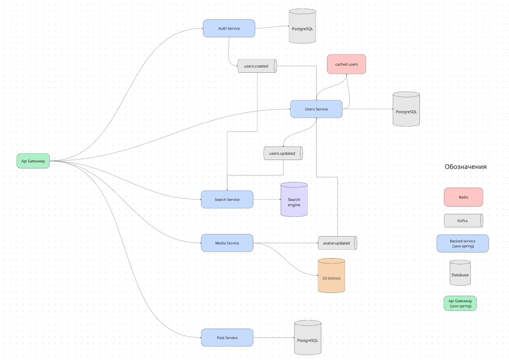

# Metaclone
<p align="center">
  
</p>


Целью проекта является получения навыков разработки andorid и backend приложений.
Участники проекта
- @Ikrom27
- @DarkDragon3333

# Backend
## Описание
Микросервисный бэкенд, написанный на Java Srping, который копируем базовые функции инстаграма:

1. Регистрация, авторизация (через jwt)
2. Редактирование профиля
3. Создание постов с фотографиями
4. Поиск пользователей



## Стек
1. Java
2. Spring boot
3. Spring security
4. Spring JPA
5. Posgres,
6. Minio (S3 объектная база данных)
7. Redis (для кеширования)
8. Lombok
9. TestContainers
10. kafka

## Сборка
В .env файле указаны все переменные среды, при запуске через IDEA обязательно нужно указать этот файл в run config.
Для запуска всей системы через докер:

```
docker-compose up
```

## Будущие цели
Это хоть рабочий, но достаточно маленький проект, который будет и дальше разрабатываться для развития навыков разработчиков
Планируется:
- доработка старых фичей (удаление пользователей, логирование ошибок, очистка S3 и прочее)
- новые фичи (лайки, комментарии)
- сбор аналитики
- логирование и мониторинг
- стресстестирование
- симуляция работы
